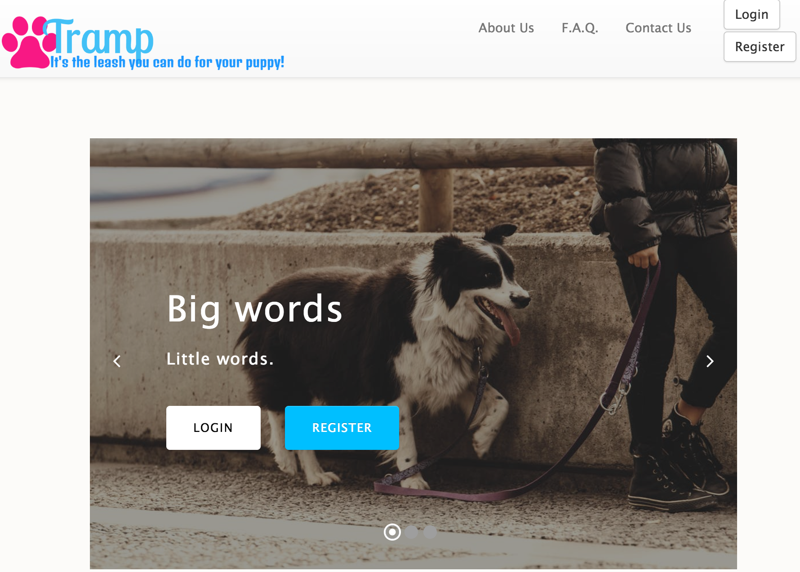

# Tramp

An application developed with the independent dog walker in mind.  Tramp allows the independent dog walker the ability to manage their clients, schedules, and payment process.  Tramp also allows for the independent minded dog owner to schedule walks with dog walkers in their area, along with allowing easy payment method.

# Landing Page

## Technologies Used

- Express.js
- node.js
- Postgres
- SASS/CSS
- knex
- bootstrap

## API's Used

- dogsURL="http://young-anchorage-23408.herokuapp.com/dogs";
- ownersURL = "http://young-anchorage-23408.herokuapp.com/owners";
- walkersURL="http://lit-garden-29083.herokuapp.com/walkers";

## Future Development

- Complete bi-directional scheduling interface
- Complete payment method interface
- Database for entering puppy data
